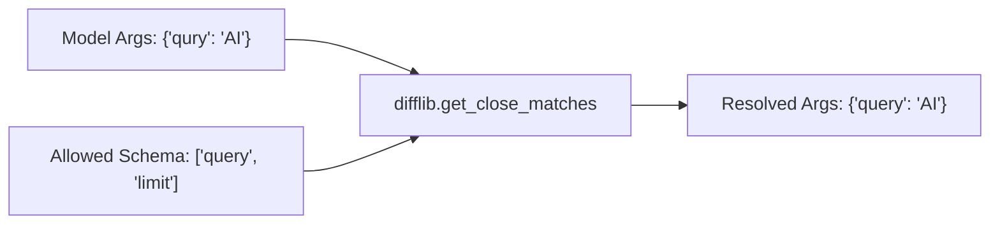

# genpark-fuzzy-tool-parameter-name-resolver-skill

Fuzzy argument key alignment matching misspelled or near-match parameter names to target schema definitions.

## Architecture

## Features
- **Configurable Cutoff**: Flexible similarity thresholds.
- **Pure Python**: 100% standard library.
